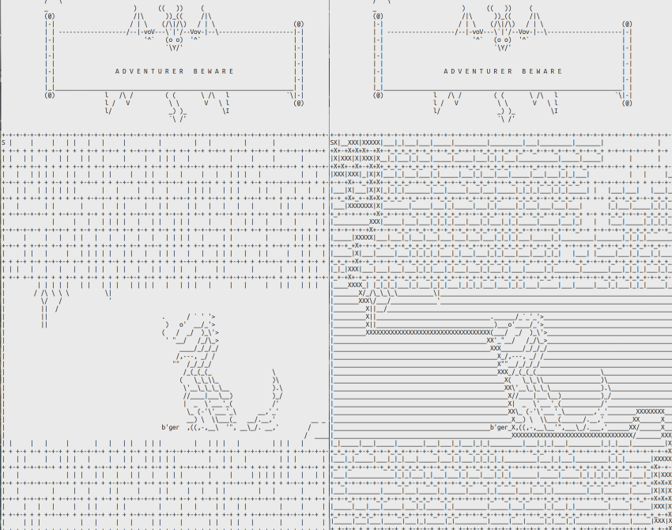

# mazesolver, tictactoe, towers of hanoi

### callbacks and i/o practice in js

- mazesolver finds the quickest path to the finish using a breadth-first search.

- mazesolver is not initimidated by dragons
